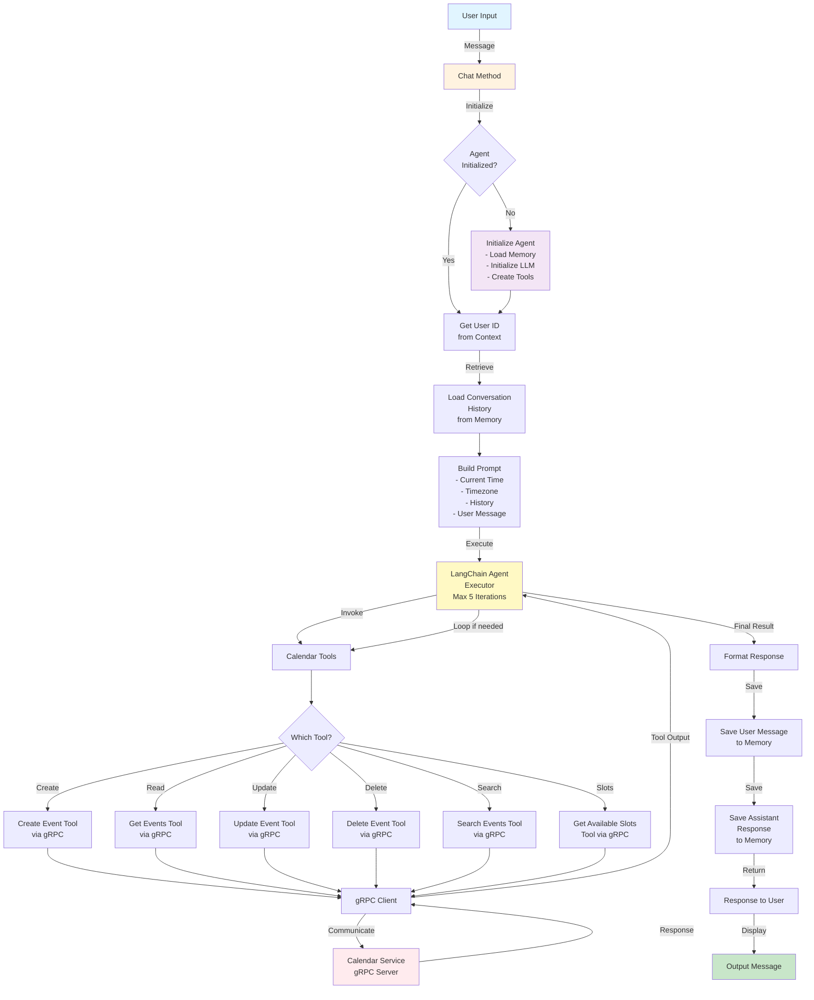

# Orbit-Orbi

Orbi is a practice. Orbi is a state of being. Orbi is the pinnacle of human experience.

> NOTE: Documentation has been consolidated. See `DOC_SUMMARY.md` for a single canonical overview (architecture, implementation, deployment and examples).

## Overview

Orbi is an intelligent agentic chatbot module for smart calendar management, built with Go. It leverages langchain-go for natural language processing and communicates with calendar services via gRPC.

## Features

- **Smart Calendar Agent**: AI-powered chatbot for natural language calendar interactions
- **gRPC Communication**: Efficient communication with calendar services using Protocol Buffers
- **LangChain Integration**: Built with langchain-go for advanced AI capabilities
- **Calendar Operations**:
  - Create, update, and delete calendar events
  - Query events within time ranges
  - Find available time slots
  - Manage event attendees and locations

## Project Structure

```
.
├── cmd/
│   └── orbi/           # Main application entry point
├── pkg/
│   ├── orbi/           # Core agent implementation
│   └── grpcclient/     # gRPC client for calendar service
├── proto/              # Protocol Buffer definitions and generated code
├── configs/            # Configuration files
├── Makefile           # Build and development tasks
└── README.md          # This file
```

## Prerequisites

- Go 1.21 or higher
- Protocol Buffers compiler (protoc)
- OpenAI API key (for LLM functionality)
- Access to a calendar service implementing the gRPC protocol

## Installation

1. Clone the repository:
```bash
git clone https://github.com/waydxd/Orbit-Orbi.git
cd Orbit-Orbi
```

2. Install dependencies:
```bash
make deps
```

3. Install protoc tools (if not already installed):
```bash
make install-proto-tools
```

4. Generate protobuf code:
```bash
make proto
```

## Configuration

Set the following environment variables:

```bash
export CALENDAR_SERVICE_ADDR="localhost:50051"  # Calendar service gRPC address
export OPENAI_API_KEY="your-openai-api-key"     # OpenAI API key
export OPENAI_MODEL="gpt-3.5-turbo"             # OpenAI model (optional)
```

Alternatively, you can modify the configuration in `configs/config.yaml`.

## Usage

### Building

Build the Orbi chatbot:
```bash
make build
```

### Running

Run the agent server:
```bash
make run
```

Or run directly:
```bash
./bin/orbi
```

The agent runs in server mode only. Clients connect via gRPC to send messages.
Use the `/livez` and `/readyz` HTTP endpoints (default port `8088`) to check health and readiness.

## Development

### Code Formatting

Format the code:
```bash
make fmt
```

### Code Vetting

Run go vet:
```bash
make vet
```

### Testing

Run tests:
```bash
make test
```

### Run All Checks

```bash
make check
```

## gRPC Protocol

The calendar service should implement the following gRPC service defined in `proto/calendar.proto`:

- `CreateEvent`: Create a new calendar event
- `GetEvents`: Retrieve events within a time range
- `UpdateEvent`: Update an existing event
- `DeleteEvent`: Delete an event
- `GetAvailableSlots`: Find available time slots

## Architecture

### Components

1. **Orbi Agent** (`pkg/orbi/agent.go`): Core chatbot agent using langchain-go
2. **gRPC Client** (`pkg/grpcclient/client.go`): Client for calendar service communication
3. **Protocol Buffers** (`proto/calendar.proto`): Service and message definitions
4. **Main Application** (`cmd/orbi/main.go`): CLI interface for the chatbot

### Flow

```
User Input → Orbi Agent → LangChain Tools → gRPC Client → Calendar Service
                ↓                                              ↓
            AI Response ← Process Response ← gRPC Response ← Calendar Data
```

### Agent Workflow Diagram



#### Agent Components

- **Memory System**: Maintains conversation history (Redis or In-Memory)
  - Stores user and assistant messages
  - Retrieves last 10 messages for context
  
- **LLM (OpenAI)**: Processes natural language
  - Receives augmented prompts with context
  - Makes decisions about which tools to use
  - Returns AI-generated responses
  
- **Calendar Tools**: LangChain tool implementations
  - Create, read, update, delete events
  - Search for events
  - Find available time slots
  
- **gRPC Client**: Communicates with Calendar Service
  - Translates tool calls to gRPC requests
  - Handles Protocol Buffers serialization
  
- **User Session Context**: Extracted from gRPC metadata
  - User ID for personalization
  - Timezone for time-aware operations

## Extending Orbi

### Adding New Tools

To add new calendar tools, create a new tool struct in `pkg/orbi/agent.go`:

```go
type myNewTool struct {
    client *grpcclient.CalendarClient
}

func (t *myNewTool) Name() string {
    return "my_new_tool"
}

func (t *myNewTool) Description() string {
    return "Description of what the tool does"
}

func (t *myNewTool) Call(ctx context.Context, input string) (string, error) {
    // Implementation
}
```

Then add it to the `createCalendarTools()` method.

### Customizing the Agent

Modify the agent configuration in `pkg/orbi/agent.go` to adjust:
- Maximum iterations
- LLM model
- Tool behavior
- Response formatting

## License

AGPL-3.0

## Contributing

Contributions are welcome! Please feel free to submit a Pull Request.

## Support

For issues and questions, please open an issue on GitHub.
