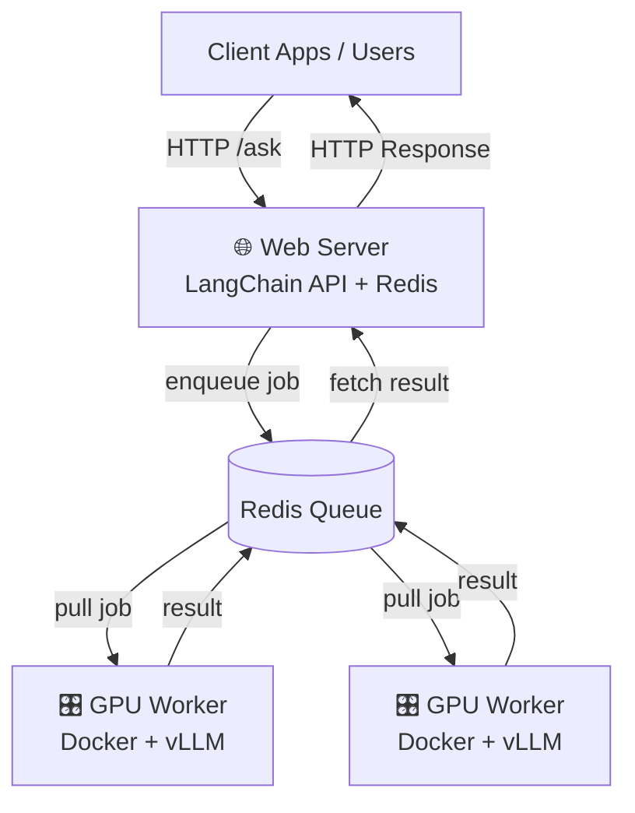
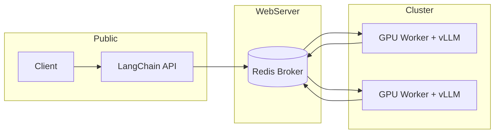

---
# 🚀 Proposal: GPU‑Backed LangChain API with Redis Message Broker

## 🎯 Goal

Provide a **public LangChain API** hosted on our web server, while offloading heavy **LLM inference** to the school’s GPU cluster.  
This ensures:

- Fast response times (GPU acceleration via vLLM).
- Secure design (no exposed cluster ports).
- Scalable architecture (multiple GPU workers).

---

## 🏗️ System Architecture

---

## 🔄 Workflow

1. **Client → Web Server**
    
    - User calls `/ask` endpoint on the public API.
2. **Web Server → Redis**
    
    - API enqueues the request as a job.
3. **GPU Worker (Cluster)**
    
    - Worker container pulls the job from Redis.
    - Calls **vLLM** locally (`localhost:8000`) to run inference.
    - Pushes the result back into Redis.
4. **Web Server → Client**
    
    - API retrieves the result from Redis.
    - Returns the answer to the client.

---

## ⚙️ Components

- **Web Server**
    
    - Hosts Redis (already running).
    - Hosts LangChain API (FastAPI/Flask).
    - Manages job submission and result retrieval.
- **Redis (Message Broker)**
    
    - Acts as the queue between API and GPU workers.
    - Ensures reliability and scalability.
- **GPU Workers (Cluster)**
    
    - Docker containers running:
        - vLLM with **Mistral‑7B‑AWQ** (quantized for speed/VRAM efficiency).
        - Worker script that connects to Redis, processes jobs, and returns results.

---

## 📈 Benefits

- **Security:** No inbound ports on the cluster.
- **Scalability:** Add more GPU workers to handle higher load.
- **Resilience:** Jobs persist in Redis until processed.
- **Simplicity:** Only one API endpoint (`/ask`) exposed to clients.

---

## 📊 Deployment Diagram

---

## ✅ Conclusion

This design cleanly separates **public API hosting** (web server) from **GPU inference runtime** (cluster).  
It leverages Redis as a **message broker**, ensuring secure, scalable, and efficient handling of LLM requests.

---
